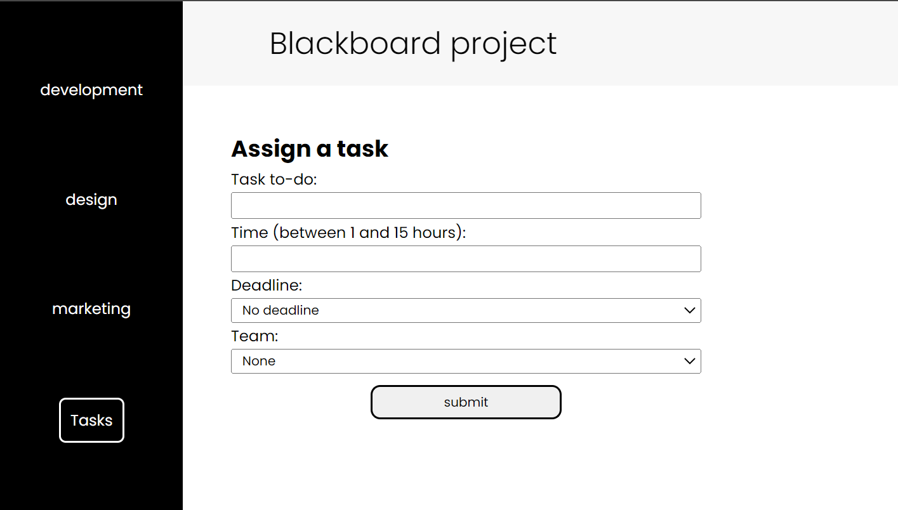

# Blackboard project

[Explainer video](https://www.loom.com/share/96d96349d45a42dbb4a40064fe7637f3)

## Online version

[Live version](https://630322bf80a0122e23b7ce78--playful-stardust-41d3fc.netlify.app/)

## Preview image

## Built With

- React
- XML
- CSS
- React hooks
- Lift state up
- React functional components

## Authors

👤 **Luis pomare**

- GitHub: [@luis-pomare](https://github.com/luis-pomare)
- Twitter: [@LuisPomare1](https://twitter.com/LuisPomare1)
- LinkedIn: [luis-pomare](https://www.linkedin.com/in/luis-pomare/)

